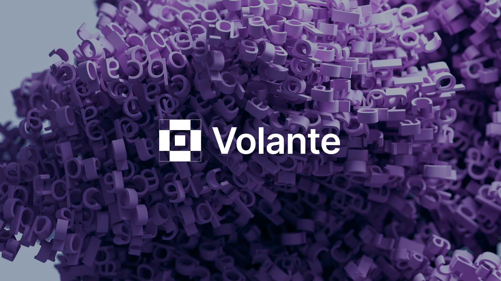
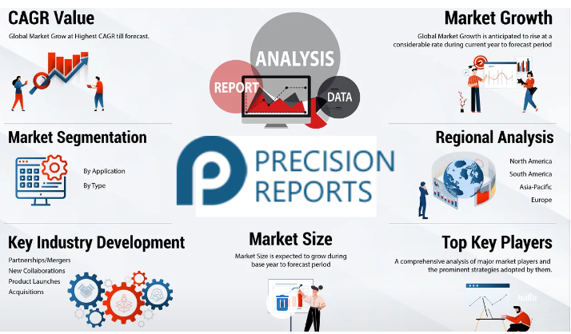

# Home

<figure><figcaption></figcaption></figure>

## Tabla de contenido:


[Introducción](https://app.gitbook.com/s/75neFLuTt4qrehZw3Uip/introduction)



[Objetivo del proyecto](https://app.gitbook.com/s/75neFLuTt4qrehZw3Uip/project-objective)



[Características clave](https://app.gitbook.com/s/75neFLuTt4qrehZw3Uip/key-features)



[Diseño arquitectónico de Volante](https://app.gitbook.com/s/75neFLuTt4qrehZw3Uip/volante-architectural-design)



[Casos de uso](https://app.gitbook.com/s/75neFLuTt4qrehZw3Uip/use-cases)



[Beneficios de Volante](https://app.gitbook.com/s/75neFLuTt4qrehZw3Uip/benefits-of-volante)



[Plan de implementación](https://app.gitbook.com/s/75neFLuTt4qrehZw3Uip/implementation-plan)


***

### **Las tendencias del mercado:**

#### **Creciente demanda de aplicaciones descentralizadas (dApps)**

* **Tendencia**: La demanda de dApps está creciendo rápidamente debido a sus beneficios en seguridad, transparencia y control del usuario en comparación con las aplicaciones tradicionales.
* **La ventaja de Volante**: Volante ofrece una plataforma fácil de usar para desarrolladores con herramientas y documentación sólidas, lo que facilita a los desarrolladores la creación e implementación de dApps. Su infraestructura escalable y segura garantiza que las dApps puedan manejar grandes bases de usuarios de manera eficiente.

**💁‍♀️ Información de respaldo**: Según la investigación, el segmento de la nube pública, que admite soluciones blockchain escalables y rentables, dominó el mercado con más del 61 % de los ingresos globales en 2022.

<figure><figcaption></figcaption></figure>

<mark style="color:green;"> **Creciente enfoque en la privacidad y la seguridad**</mark>

**Tendencia**:

Ante la creciente preocupación por las violaciones de datos y la privacidad, existe una fuerte demanda en el mercado de tecnologías que mejoren la privacidad y la seguridad.

<figure><figcaption></figcaption></figure>

* **Ventaja de Volante**: Volante utiliza pruebas avanzadas de conocimiento cero (ZK-SNARK y ZK-STARK) para garantizar que las transacciones sean privadas y seguras, lo que lo convierte en la opción preferida de los usuarios preocupados por la privacidad.

**💁‍♀️ Información de respaldo**: La adopción de la tecnología blockchain en los servicios financieros, que priorizan las transacciones seguras, representó más del 37% de los ingresos globales en 2022.

<figure><figcaption></figcaption></figure>

<mark style="color:green;"> **Auge de DeFi (Finanzas Descentralizadas)**</mark>

* **Tendencia**: DeFi se ha vuelto importante, permitiendo a los usuarios acceder a servicios financieros sin intermediarios tradicionales.
* **Ventaja de Volante**: la plataforma de Volante admite aplicaciones DeFi complejas con su sistema de prueba de participación (PoS) energéticamente eficiente y puentes de datos seguros.

**💁‍♀️ Información de apoyo**: El segmento de pagos, un aspecto central de DeFi, dominó el mercado en 2022 con más del 44% de participación en los ingresos globales.

<figure><figcaption></figcaption></figure>

####<mark style="color:green;"> **Sostenibilidad del medio ambiente**</mark>

* **Tendencia**: Existe una demanda creciente de tecnologías ambientalmente sostenibles, ya que las redes blockchain son criticadas por su alto consumo de energía.
* **Ventaja de Volante**: El mecanismo PoS de Volante promueve operaciones energéticamente eficientes, abordando preocupaciones ambientales.

**💁‍♀️ Información de respaldo**: La sostenibilidad es un factor crucial, especialmente con las crecientes regulaciones para proteger los datos de los consumidores y reducir el consumo de energía.

<figure><figcaption></figcaption></figure>

<mark style="color:green;"> **Adopción de Blockchain en diversas industrias**</mark>

* **Tendencia**: La tecnología Blockchain se está adoptando en diversas industrias, incluidas las de juegos, comercio electrónico, atención médica y gestión de la cadena de suministro.

<figure><figcaption></figcaption></figure>

* **Ventaja de Volante**: la plataforma versátil de Volante puede admitir una amplia gama de aplicaciones, lo que la hace adecuada para múltiples sectores verticales.

**💁‍♀️ Información de respaldo**: Se espera que el segmento de atención médica crezca al CAGR más alto debido a la necesidad de una gestión de datos segura y eficiente.

<figure><figcaption></figcaption></figure>

<mark style="color:green;"> **Interoperabilidad y soluciones multicadena**</mark>

* **Tendencia**: Existe la necesidad de interoperabilidad entre diferentes redes blockchain para facilitar la transferencia fluida de activos y datos.
* **Ventaja de Volante**: Las características de interoperabilidad multicadena de Volante permiten interacciones fluidas entre diferentes blockchains, mejorando la experiencia del usuario.

<figure><figcaption></figcaption></figure>

**💁‍♀️ Información de respaldo**: La capacidad de optimizar las cadenas de suministro y gestionar las transacciones financieras de manera eficiente está impulsando la adopción de la tecnología blockchain.

####<mark style="color:green;"> **Gobernanza descentralizada y participación comunitaria**</mark>

* **Tendencia**: Los modelos de gobernanza descentralizada están ganando popularidad, donde las comunidades tienen voz en el desarrollo y gestión de proyectos blockchain.
* **Ventaja de Volante**: el DAO de Volante y el mecanismo de votación cuadrática garantizan una toma de decisiones justa e inclusiva, empoderando a los usuarios y fomentando una comunidad fuerte.

<figure><figcaption></figcaption></figure>

**💁‍♀️ Información de apoyo**: Las empresas están adoptando cada vez más una gobernanza descentralizada para mejorar la confianza y el compromiso dentro de sus ecosistemas.

####<mark style="color:green;"> **Conclusión**</mark>

Volante está estratégicamente posicionado para aprovechar las tendencias clave del mercado en los sectores de tecnología y blockchain. Su enfoque en escalabilidad, privacidad, seguridad, eficiencia energética e interoperabilidad aborda las demandas actuales del mercado. Al admitir una amplia gama de aplicaciones y fomentar la gobernanza descentralizada, Volante está preparado para un crecimiento y una adopción significativos en diversas industrias.

###<mark style="color:green;"> Referencias:</mark>

[Grandview Research - Blockchain Technology Market](https://www.grandviewresearch.com/industry-analysis/blockchain-technology-market)

[Transparency Market Research - Blockchain Technology Market](https://www.transparencymarketresearch.com/blockchain-technology-market.html)

[Sealpath - Data Security 2023 Trends](https://www.sealpath.com/blog/data-security-2023-trends)

[LinkedIn - Rise of Decentralized Finance (DeFi) - A Decade of Transformation](https://www.linkedin.com/pulse/rise-decentralized-finance-defi-decade-transformation-ris-pmp-/)

[Greenmatch - Sustainability Trends](https://www.greenmatch.co.uk/blog/sustainability-trends)

[Deloitte - Inclusive Deployment of Blockchain for Supply Chains](https://www2.deloitte.com/us/en/pages/about-deloitte/articles/inclusive-deployment-of-blockchain-for-supply-chains.html)

[ResearchGate - Various Industries Expected to Benefit from Blockchain](https://www.researchgate.net/figure/Various-industries-are-expected-to-benefit-from-blockchain_fig1_339442490)

[Magnimind](https://magnimind)
